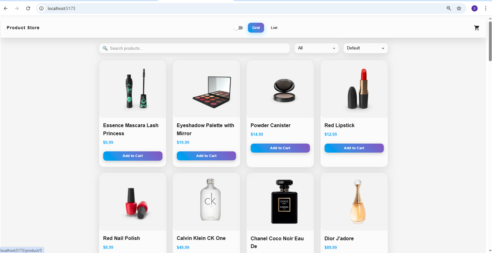
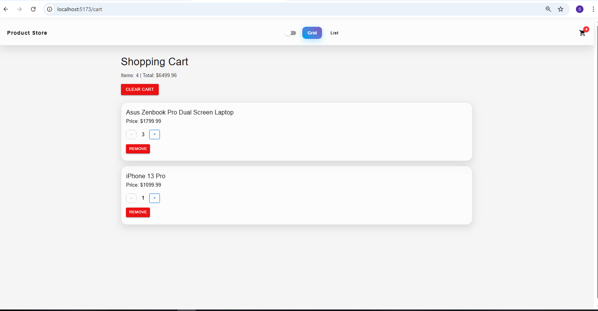
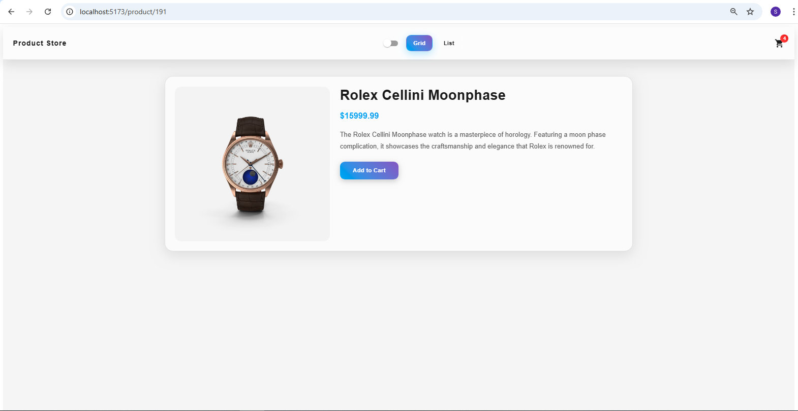
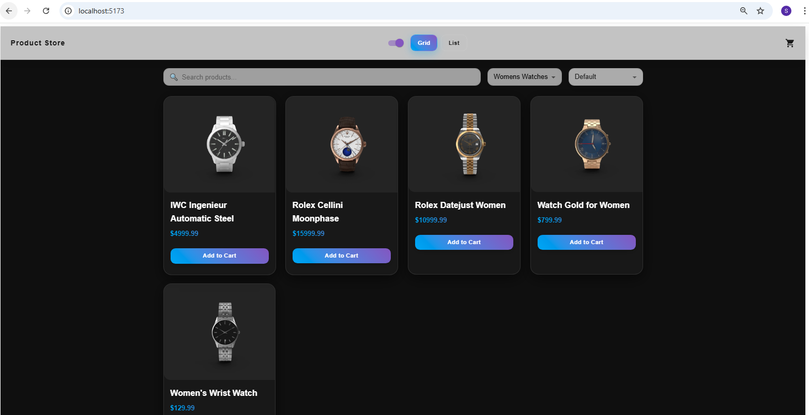
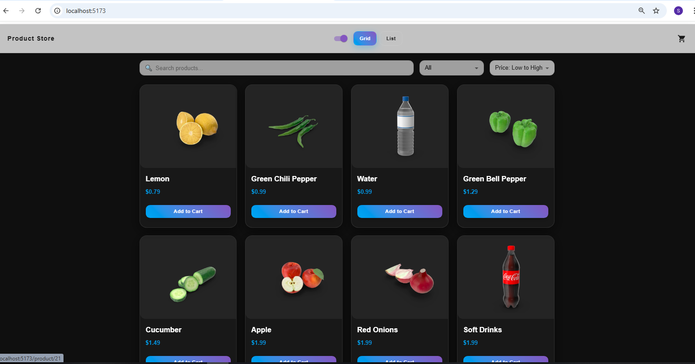
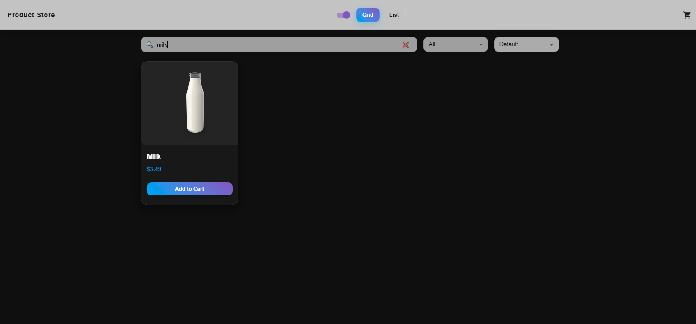
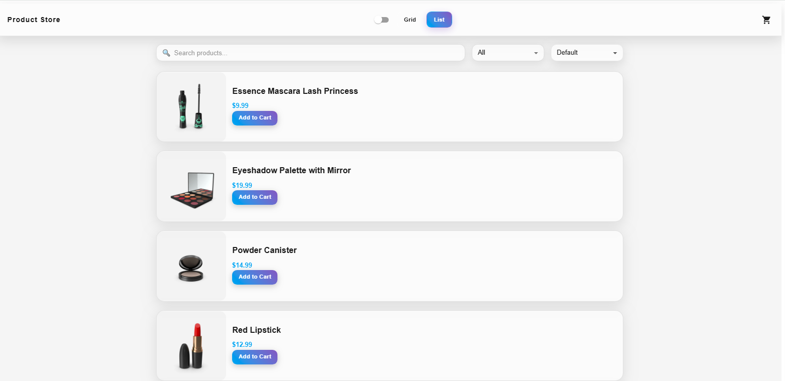

# Product Store App
## Project Description
This is a Product Store web application built with React.
The app allows users to browse products, view details, and manage a shopping cart.

This project demonstrates how to combine multiple state management approaches in a real-world React application.
It focuses on performance, scalability, and clean architecture.

---

## Project Goal

The goal of this project was to practice real-world React architecture using multiple state management tools in a scalable e-commerce application.

---

## What I Learned

- Managing global state using Context API and useReducer
- Using Redux Toolkit for scalable state management
- Fetching and caching data with React Query
- Handling loading and error states
- Building reusable components

## Features
### State Management

#### Context API + useReducer
- Dark / Light mode
- Grid / List view
- Category selection

#### Redux Toolkit (Cart)
- Add to cart
- Remove from cart
- Increase / decrease quantity
- Clear cart
- Total items & total price calculation

#### React Query
- Fetch products from API
- Loading state
- Error handling
- Data caching

#### Infinite Scroll / Pagination
- Automatically loads more products when the user scrolls down
- Improves performance by loading data in chunks instead of all at once
- Uses API pagination to fetch additional products dynamically

## Future Improvements

- Improve UI/UX design
- Add product reviews and ratings
- Implement wishlist feature
- Enhance filtering and sorting options
- Improve performance and optimize API requests

### App Functionality
- Display products from API
- Filter products by category
- Sort products
- Responsive UI
- Product details page

### Technologies Used
- React
- JavaScript (ES6+)
- Redux Toolkit
- React Query
- Context API
- Material UI

---

### API Used
DummyJSON Products API

---

## Demo
[Watch Demo Video](https://youtu.be/7PLho2oivFs)

---

## Screenshots

### Home


###  Shopping Cart


### Details


### Filter by category


### Sort


### Search by title/name 


### List view


---

## Project Structure

```bash

 src/
 ├── components/
 │ ├── Navbar/
 │ ├── ProductCart/
 │ ├── CategoryFilter/
 │ ├── SearchBar/
 │ ├── SortProduct/
 ├── context/
 │ ├── SettingsContext/
 ├── pages/
 │ ├── Cart/
 │ ├── Home/
 │ ├── ProductDetails/
 │ ├── Settings/
 ├── redux/
 │ ├── cartSlice/
 │ ├── store/
 ├── services/
 │ ├── api/
```

---

## GitHub Repository

[View Repository](https://github.com/somaiamosadeq1212/Assignment-9)

---

## Installation & Running

### Navigate into the project folder:

``` bash
cd product-store
```

### Install dependencies:

```bash
npm install
```

### Start the development server:

```bash
npm run dev
```

### Open the app in your browser:

```bash
http://localhost:5173
```

## Author
- Somaya Mosadiq
- React Developer